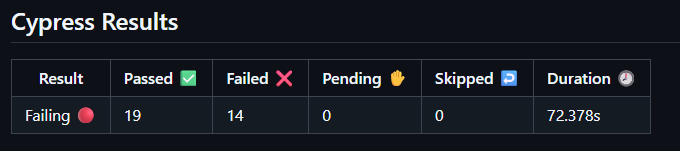

# 📌 CAC - Central de Atendimento

--- 

## 📝 Conhecendo a aplicação em teste

A aplicação se chama Central de Atendimento ao Cliente TAT - [**CAC TAT**](https://cac-tat-v3.s3.eu-central-1.amazonaws.com/index.html) - e foi desenvolvida usando HTML, CSS e JavaScript.

### Funcionalidades da aplicação

A Aplicação CAC TAT simula o envio de mensagens para uma central de atendimento ao cliente.

#### Campos obrigatórios

Os seguintes campos são obrigatórios e **devem** ser preenchidos antes do envio do formulário:

- Nome (campo do tipo de texto)
- Sobrenome (campo do tipo de texto)
- E-mail (campo do tipo e-mail, **com validação**)
- Como podemos te ajudar? Algum elogio ou feedback para nós? (campo de área de texto)

#### Outros campos

Além dos campos obrigatórios, o “cliente” pode inserir:

- Telefone (campo do tipo número)
- Produto (campo suspenso com as opções: Blog, Cursos, Mentoria ou YouTube)
- Tipo de atendimento (campos do tipo radio com as opções: Ajuda, Elogio ou Feedback)
- Meio de contato preferencial (caixa de seleção com as opções: E-mail e/ou Telefone)
- Adicione um anexo (campo do tipo arquivo)

#### Regras dos meios de contato preferenciais

- Quando a caixa de seleção do telefone é marcada, o _input_ do número de telefone torna-se obrigatória
- Ao desmarcar a caixa de seleção do telefone, a inserção do número de telefone deixa de ser obrigatória

#### Política de Privacidade

Ao clicar no link [Política de Privacidade](https://cac-tat-v3.s3.eu-central-1.amazonaws.com/privacy.html) na parte inferior da página, ela abre em uma nova aba do navegador.

#### Mensagens

⚠️ Caso haja algum problema relacionado aos campos obrigatórios, a seguinte mensagem é exibida com fundo roxo: `Validar os campos obrigatórios!`

✅ Quando o formulário é enviado com sucesso, a seguinte mensagem é exibida com fundo cinza: `Mensagem enviada com sucesso.` Além disso, todos os campos voltam ao seu estado inicial.

> Ambas as mensagens são exibidas por apenas três segundos. Depois disso, elas desaparecem.

--- 

## 💾 Sistemas
Antes de começar, certifique-se de que os seguintes sistemas estejam instalados em seu computador.

- [git](https://git-scm.com/) (`2.51.1` no momento dos testes)
- [Node.js](https://nodejs.org/en/) (`v22.21.0` no momento dos testes)
- npm (`11.8.0` no momento dos testes)
- [Visual Studio Code](https://code.visualstudio.com/) (`v1.90` no momento dos testes) ou alguma outra IDE de sua preferência

> **Obs. 1**: Recomendo usar as mesmas versões ou versões mais recentes de suporte de longo prazo (LTS) dos sistemas listados acima.
>  <a href="https://nodejs.org/pt">
      
   </a> 
> **Obs. 2**: Ao instalar o Node.js, o npm é instalado junto. 
> **Obs. 3:** Para verificar as versões do git, Node.js e npm instaladas em seu computador, execute o comando `git --version && node --version && npm --version` em seu terminal de linha de comando.
>
> **Obs. 4:** Deixei links para os instaladores na lista de requisitos acima, caso você ainda não os tenha instalados.

---
# 💻 Instalando
1. Na raiz do projeto, execute o comando `npm install cypress --save-dev`. 
2. Execute o comando `npx cypress open` para abrir o Cypress pela primeira vez e deixe-o guiá-lo na criação de uma suite de testes de ponta a ponta (E2E).    
3. Por fim, com a Cypress App aberta, crie um arquivo com o nome desejado com a extensão `.cy.js` e feche a Cypress App.    

> Obs.: Quando iniciado pela primeira vez, o Cypress cria automaticamente o arquivo `cypress.config.js` e o diretório `cypress/`, com seus subdiretórios `e2e/`, `fixtures/` e `support/`, com seus respectivos arquivos.

## ⚙️ Configuração Extra
- Atualize o arquivo `cypress.config.js` da seguinte maneira.

```javascript
  const { defineConfig } = require('cypress')

module.exports = defineConfig({
  viewportHeight: 880,
  viewportWidth: 1280,
  e2e: {},
})
```
---

## 📊 Resultados e Demonstrações
Pipeline CI/CD   


- ...

## 🛠 Tecnologias Utilizadas
- Linguagem: JavaScript
- Ferramentas: Cypress
- Tipos de Teste: Automatizado

## 📂 Estrutura do Projeto
CAC  
├── .github/
│   └── ci.yml 
├── cypress/  
│   └── e2e/  
│   │   ├── arquivo.cy.js  
│   │   ├── link.cy.js  
│   │   ├── negative.cy.js  
│   │   ├── obrigatoriedade.cy.js  
│   │   └── smokeTest.cy.js   
│   └── fixtures/  
│   │   ├── example.json  
│   └── support/  
│   │   ├── commands.js  
│   │   └── e2e.js  
├── src/ 
│   ├── index.html  
│   ├── privacy.html  
│   ├── script.js  
│   └── style.css  
├── .gitignore  
├── cypress.config.js  
├── package.json  
├── package-lock.json  
├── LICENSE  
└── README.md  


--- 

## 📌 Próximos Passos

 - Melhoria no codigo

## 👩‍💻 Contatos
 
<div style="display: inline">
<a href="https://www.linkedin.com/in/in%C3%AAs-m-065b8681/">
  
</a>     
      
<a href="https://gitlab.com/inessmelo/postmancollection/-/tree/main">
  
</a>
</div>
